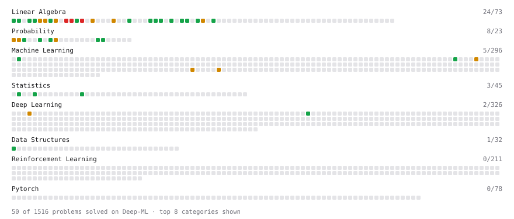

# Deep-ML

My machine learning practice from [Deep-ML](https://www.deep-ml.com). Every solution here was written by hand.

**38** solved · 30 problems · 0 labs · 8 math

[**Browse the interactive portfolio**](https://lekeduccodemaster.github.io/deep-ml/) to replay this filling in over time.

## Problems

| | Difficulty | Solved | |
| --- | --- | --- | --- |
| [Calculate 2x2 Matrix Inverse](https://www.deep-ml.com/problems/8) | easy | 2026-08-10 | [solution](problems/0008-calculate-2x2-matrix-inverse) |
| [Calculate Conditional Probability from Data](https://www.deep-ml.com/problems/168) | easy | 2026-08-20 | [solution](problems/0168-calculate-conditional-probability-from-data) |
| [Calculate Cosine Similarity Between Vectors](https://www.deep-ml.com/problems/76) | easy | 2026-08-21 | [solution](problems/0076-calculate-cosine-similarity-between-vectors) |
| [Compute Posterior Probability using Bayes' Theorem](https://www.deep-ml.com/problems/336) | easy | 2026-08-15 | [solution](problems/0336-compute-posterior-probability-using-bayes-theorem) |
| [Compute the Cross Product of Two 3D Vectors](https://www.deep-ml.com/problems/118) | easy | 2026-08-10 | [solution](problems/0118-compute-the-cross-product-of-two-3d-vectors) |
| [Derivative of a Polynomial](https://www.deep-ml.com/problems/116) | easy | 2026-08-02 | [solution](problems/0116-derivative-of-a-polynomial) |
| [Dot Product Calculator](https://www.deep-ml.com/problems/83) | easy | 2026-08-01 | [solution](problems/0083-dot-product-calculator) |
| [Gradient Direction and Magnitude](https://www.deep-ml.com/problems/308) | easy | 2026-08-21 | [solution](problems/0308-gradient-direction-and-magnitude) |
| [Matrix-Vector Dot Product](https://www.deep-ml.com/problems/1) | easy | 2026-07-31 | [solution](problems/0001-matrix-vector-dot-product) |
| [Min-Max Scaling of Feature Values](https://www.deep-ml.com/problems/112) | easy | 2026-10-05 | [solution](problems/0112-min-max-scaling-of-feature-values) |
| [Phi Transformation for Polynomial Features](https://www.deep-ml.com/problems/84) | easy | 2026-07-31 | [solution](problems/0084-phi-transformation-for-polynomial-features) |
| [Poisson Distribution Probability Calculator](https://www.deep-ml.com/problems/81) | easy | 2026-08-20 | [solution](problems/0081-poisson-distribution-probability-calculator) |
| [Scalar Multiplication of a Matrix](https://www.deep-ml.com/problems/5) | easy | 2026-08-21 | [solution](problems/0005-scalar-multiplication-of-a-matrix) |
| [Simulate Two-Dice Sum Distribution](https://www.deep-ml.com/problems/1139) | easy | 2026-08-15 | [solution](problems/1139-simulate-two-dice-sum-distribution) |
| [Transformation Matrix from Basis B to C](https://www.deep-ml.com/problems/27) | easy | 2026-08-10 | [solution](problems/0027-transformation-matrix-from-basis-b-to-c) |
| [Transpose of a Matrix](https://www.deep-ml.com/problems/2) | easy | 2026-08-10 | [solution](problems/0002-transpose-of-a-matrix) |
| [Vector Element-wise Sum](https://www.deep-ml.com/problems/121) | easy | 2026-08-21 | [solution](problems/0121-vector-element-wise-sum) |
| [Vector Norms (L1/L2/L-inf) and the Frobenius Norm](https://www.deep-ml.com/problems/328) | easy | 2026-08-21 | [solution](problems/0328-vector-norms-l1-l2-l-inf-and-the-frobenius-norm) |
| [Binomial Distribution Probability](https://www.deep-ml.com/problems/79) | medium | 2026-08-20 | [solution](problems/0079-binomial-distribution-probability) |
| [Calculate Eigenvalues of a Matrix](https://www.deep-ml.com/problems/6) | medium | 2026-07-31 | [solution](problems/0006-calculate-eigenvalues-of-a-matrix) |
| [Dummy Classifier Baseline](https://www.deep-ml.com/problems/847) | medium | 2026-10-05 | [solution](problems/0847-dummy-classifier-baseline) |
| [Matrix Rank](https://www.deep-ml.com/problems/329) | medium | 2026-08-01 | [solution](problems/0329-matrix-rank) |
| [Matrix times Matrix ](https://www.deep-ml.com/problems/9) | medium | 2026-08-02 | [solution](problems/0009-matrix-times-matrix) |
| [Matrix Transformation ](https://www.deep-ml.com/problems/7) | medium | 2026-08-10 | [solution](problems/0007-matrix-transformation) |
| [Normal Distribution PDF Calculator](https://www.deep-ml.com/problems/80) | medium | 2026-08-20 | [solution](problems/0080-normal-distribution-pdf-calculator) |
| [Quotient Rule for Derivatives](https://www.deep-ml.com/problems/312) | medium | 2026-08-21 | [solution](problems/0312-quotient-rule-for-derivatives) |
| [StandardScaler Fit and Transform](https://www.deep-ml.com/problems/842) | medium | 2026-10-05 | [solution](problems/0842-standardscaler-fit-and-transform) |
| [Determinant of a 4x4 Matrix using Laplace's Expansion (hard)](https://www.deep-ml.com/problems/13) | hard | 2026-07-31 | [solution](problems/0013-determinant-of-a-4x4-matrix-using-laplace-s-expansion-hard) |
| [Singular Value Decomposition (SVD) of 2x2 Matrix](https://www.deep-ml.com/problems/12) | hard | 2026-08-09 | [solution](problems/0012-singular-value-decomposition-svd-of-2x2-matrix) |
| [SVD of a 2x2 Matrix](https://www.deep-ml.com/problems/28) | hard | 2026-08-09 | [solution](problems/0028-svd-of-a-2x2-matrix) |

## Math

| | Difficulty | Solved | |
| --- | --- | --- | --- |
| [Derivatives and Gradients](https://www.deep-ml.com/math-problems/1) | easy | 2026-08-21 | [solution](math/0001-derivatives-and-gradients) |
| [Gradient Descent Updates](https://www.deep-ml.com/math-problems/5) | easy | 2026-08-21 | [solution](math/0005-gradient-descent-updates) |
| [Matrix Basics](https://www.deep-ml.com/math-problems/9) | easy | 2026-08-21 | [solution](math/0009-matrix-basics) |
| [Probability Fundamentals](https://www.deep-ml.com/math-problems/19) | easy | 2026-08-18 | [solution](math/0019-probability-fundamentals) |
| [Vector Operations](https://www.deep-ml.com/math-problems/7) | easy | 2026-08-21 | [solution](math/0007-vector-operations) |
| [Gram–Schmidt and Orthonormal Bases](https://www.deep-ml.com/math-problems/47) | medium | 2026-08-18 | [solution](math/0047-gram-schmidt-and-orthonormal-bases) |
| [Matrix Multiplication](https://www.deep-ml.com/math-problems/10) | medium | 2026-08-18 | [solution](math/0010-matrix-multiplication) |
| [Vector Norms and Linear Independence](https://www.deep-ml.com/math-problems/8) | medium | 2026-08-21 | [solution](math/0008-vector-norms-and-linear-independence) |

---

_This file is regenerated by Deep-ML on every push._
